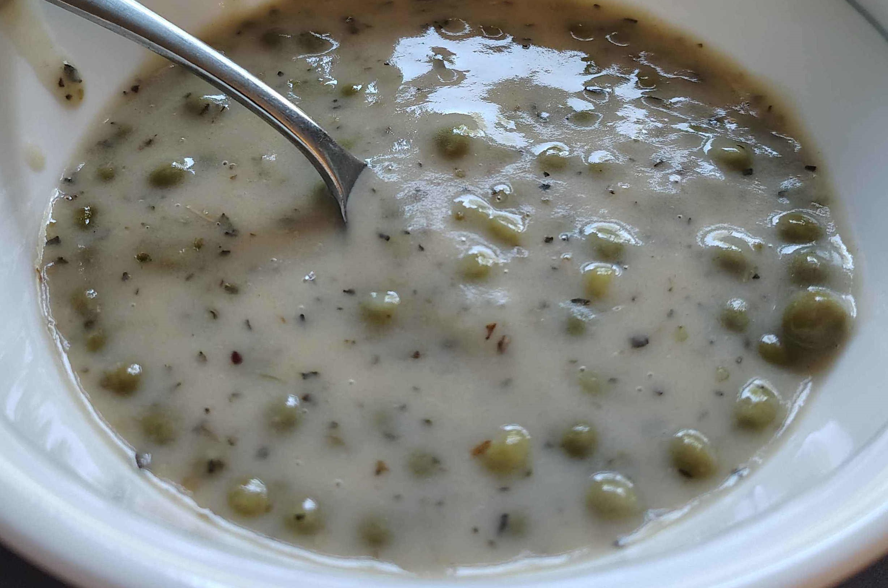

Stir continuously throughout.

Melt 1/4 cup of butter in a pot.

Saturate the butter with all purpose flour until it has the consistency of wet
sand. Allow it to cook for a few minutes.

Add two cups of [chicken broth](./chicken_broth.md) and one cup of milk. Thicken
as desired by keeping the broth at medium heat to evaporate water.

Now that the broth is done, add as desired:

- peas
- chicken
- basil
- oregano
