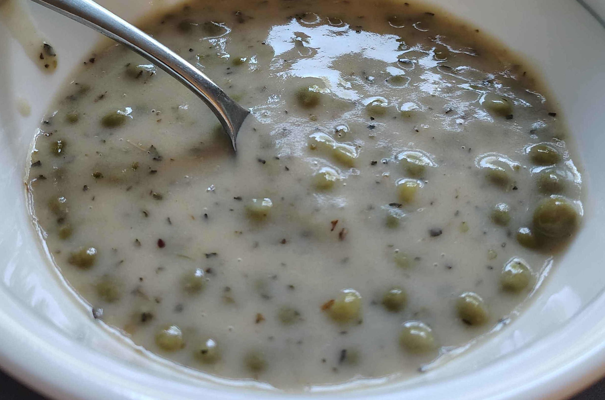

Stir continuously throughout.

Melt 1/4 cup of butter in a pot.

Add 1/4 cup of flour. Mix and allow it to cook for a few minutes.

Add one cup of [gelatinous chicken broth](./chicken_broth.md) and a half cup of
milk. Thicken as desired by keeping the broth at medium heat to evaporate water.

Now that the broth is done, add as desired:

- peas
- chicken
- basil
- oregano
- vegeta seasoning (sparingly)
