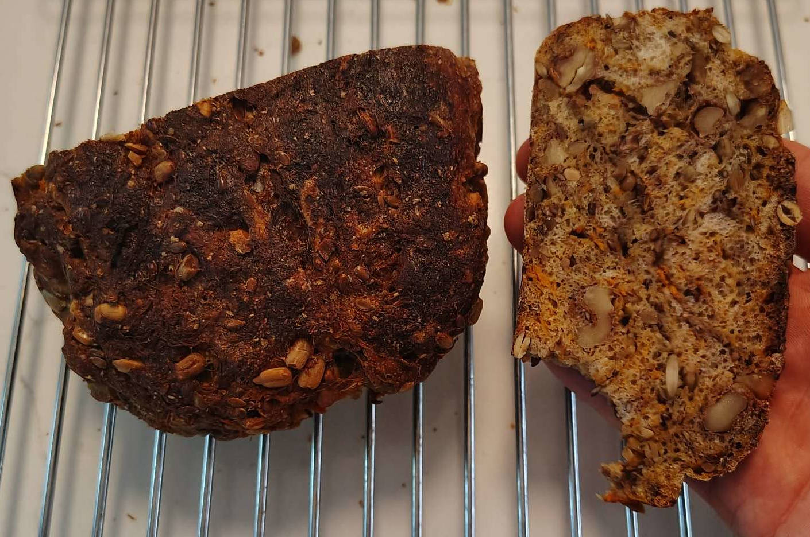
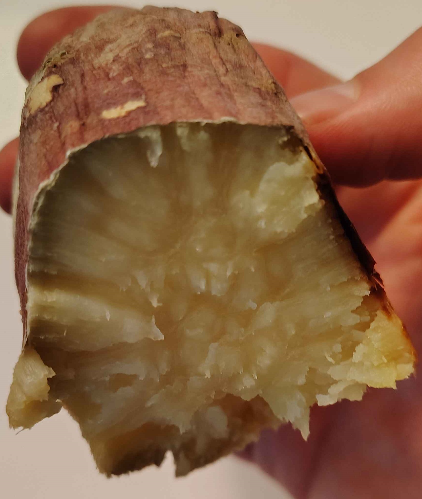
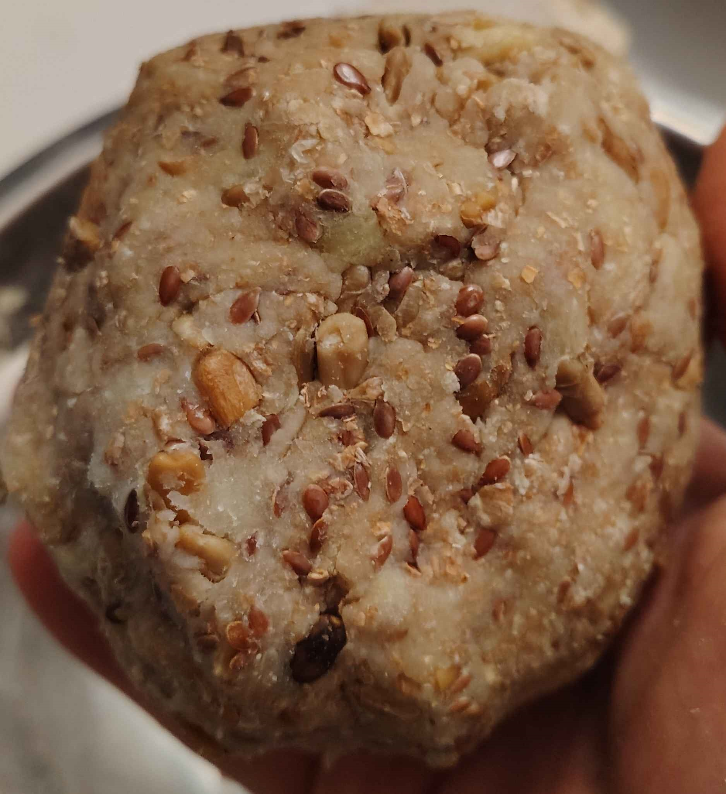

This recipe is for an old-style, firm, healthy, and nutty sourdough bread.

This makes a small loaf; consider doubling the recipe.

## Baked Root Vegetable

Obtain root vegetables and/or sweet potato. For best results, use:

- one half common (beauregard) sweet potato
- one half japanese sweet potato. To identify
  the correct variant:
    - if the skin is scratched, underneath is more red than purple
    - the flesh is off-white / faintly yellow

    

However most root vegetables which are moist and can be baked then easily mashed
would work:
- any sweet potato or yam
- squash (buttercup, butternut, ...)
- absolutely *DO NOT* use normal potatoes

Place the vegetables on parchment paper on a baking sheet. Bake at 400F for 1hr.
After baking, the skin can be pulled off and discarded. Let it cool to near room
temperature before mixing with other ingredients. Otherwise the heat will kill
the starter. But not too cold (e.g. fridge) or else it will be more difficult to
mix later on.

The sweet potato may not be 100% cooked all the way through at this temp and
time - that is ok. The slightly undercooked sweet potato contributes moisture
and may contribute a subtle sour/tangy flavor.

The final weight of this ingredient should be 200g. Add it to a mixing bowl.

## Bread Components

Add to the mixing bowl:

- 20g of sourdough starter
- 50g whole wheat flour
- 40g gluten flour

[Remember to replenish your starter.](./starter.md#replenish)

## Assorted Nuts & Seeds

Add to the mixing bowl:
- 35g crushed walnut
- 20g sunflower seeds
- 20g flax seeds
- 10g pumpkin seeds

## Mix

With effort, mix the contents of the mixing bowl.

While initially daunting, the water content of the baked yam is sufficient to
allow the ingredients to mix into a dough. Only if desperate, add water or
cashew milk (but not almond milk) sparingly to assist with conglomeration.

Consider squishing the baked yam repeatedly with a wooden spoon or by hand. Each
squish exposes wet content to absorb the ingredients.

    

## Delay

Place the dough on parchment paper in a loaf pan.

Let the dough sit for at least 12 hours at room temperature in a sheltered area;
for example, an oven that is turned off.

## Bake

Bake uncovered at 400F for 1 hr. If needed, bake for longer; it is difficult to
burn this recipe due to the root vegetable content - it instead caramelizes into
a nice crust.

If the bread is made daily, consider baking the yam for tomorrow at the same
time as the loaf for today.

Leave the bread in the oven after baking and only take it out when convenient.
Consider using the automatic start and stop time functionality found in modern
ovens. For example, the bread can start baking over night and cool somewhat
before breakfast.
