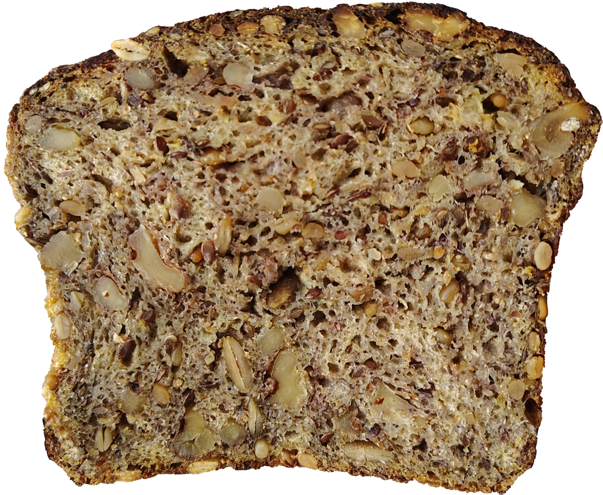
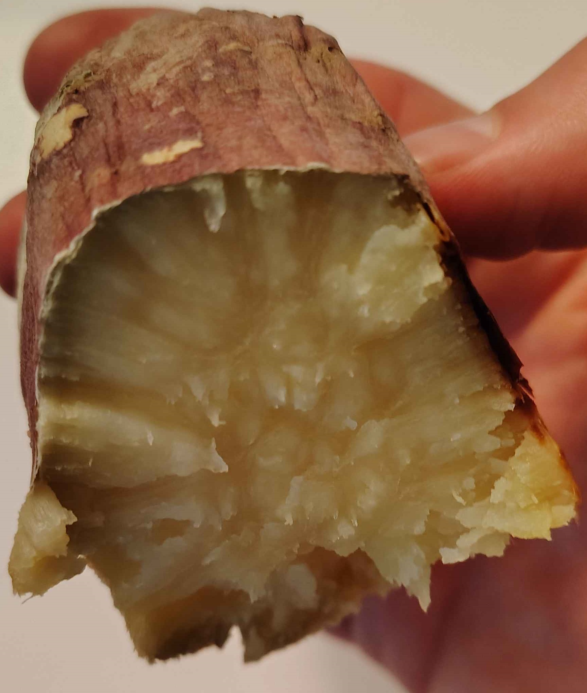
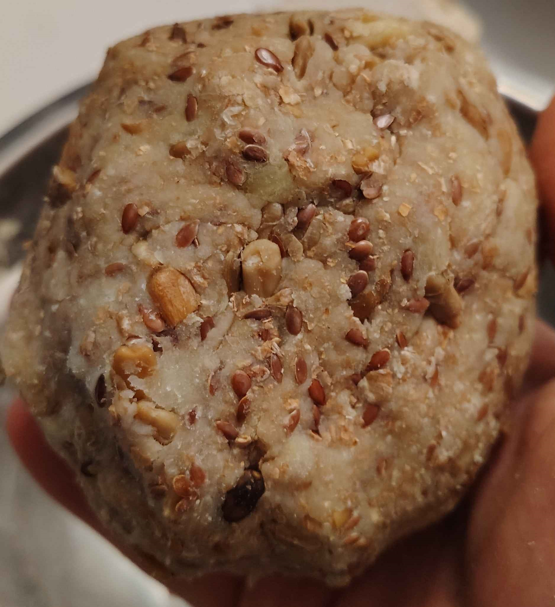
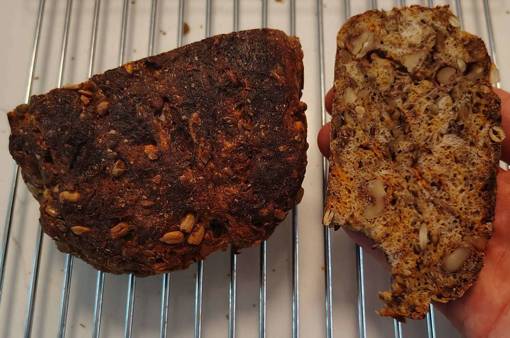

This recipe is for an old-style, firm, healthy, and nutty sourdough bread.

This makes a small loaf; consider tripling the recipe.

## Baked Root Vegetable

Obtain root vegetables and/or sweet potato. For best results, use japanese or
korean sweet potato. To identify the correct type:  
- if the skin is scratched, underneath is more red than purple
- the flesh is off-white / faintly yellow

    

However most root vegetables which are moist and can be baked then easily mashed
would work:
- any sweet potato or yam
- squash (buttercup, butternut, ...)
- absolutely *DO NOT* use normal potatoes

Place the vegetables on parchment paper on a baking sheet. Bake at 400f for 1hr
or longer. After baking, the skin can be pulled off and discarded. Let it cool
to near room temperature before mixing with other ingredients. Otherwise the
heat will kill the starter. But not too cold (e.g. fridge) or else it will be
more difficult to mix later on.

The final weight of this ingredient should be 200g. Add it to a mixing bowl.

## Bread Components

Add to the mixing bowl:

- 20g of [active](./starter.md#activate) starter
- 55g whole wheat flour
- 40g gluten flour

## Assorted Nuts & Seeds

Add to the mixing bowl:
- 35g crushed walnut
- 20g sunflower seeds
- 20g flax seeds
- 10g pumpkin seeds

## Mix

Mix the contents of the mixing bowl.

While initially daunting, the water content of the baked root vegetables is
sufficient to allow the ingredients to mix into a dough. Only if desperate, add
water or cashew milk (but not almond milk) sparingly to assist with
conglomeration.

To mix, consider balling both hands into fists, and repeatedly squishing the
dough by pressing it down into the surface of the bowl. Each squish exposes wet
content that absorbs the ingredients.

If the dough is too wet (dependent on the type of sweet potato and how it was
prepared), add a small amount of flour until it isn't overly sticky.

    

## Delay

Place the dough on parchment paper in a loaf pan.

Let the dough sit for 12-16 hours at room temperature in a sheltered area: for
example, an oven that is turned off, with the oven light on.

## Bake

Bake uncovered @ 400f for 1hr. If needed, bake for longer; it is difficult to
burn this recipe due to the root vegetable content - it instead caramelizes into
a nice crust.

If the bread is made daily, consider baking the yam for tomorrow at the same
time as the loaf for today.

Leave the bread in the oven after baking and only take it out when convenient.
Consider using the automatic start and stop time functionality found in modern
ovens. For example, the bread can start baking over night and cool somewhat
before breakfast.

Here's a end result that used half japanese sweet potato and half normal sweet
potato:

